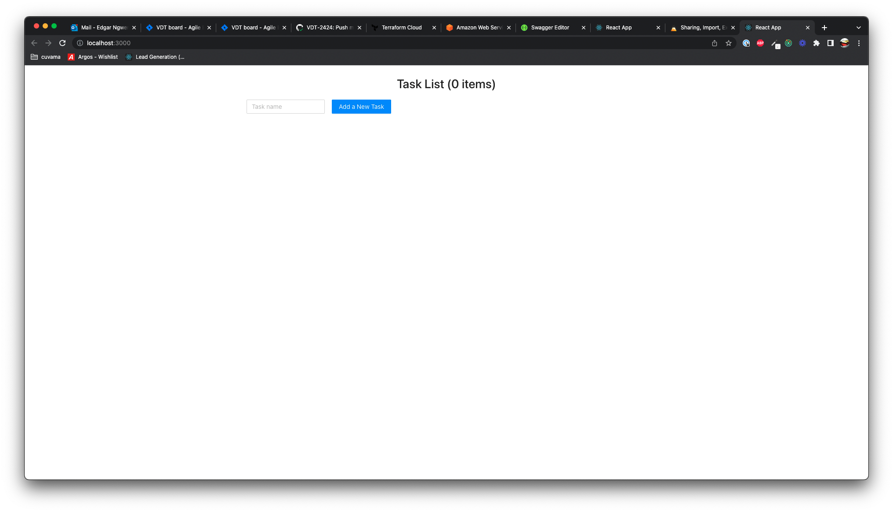
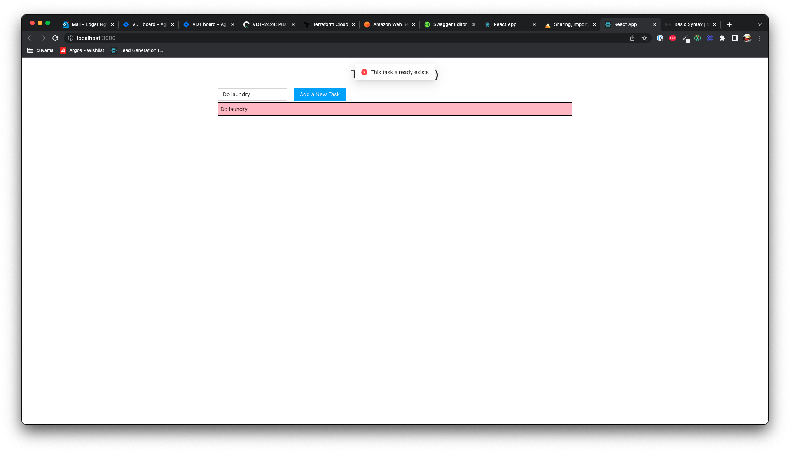

# interview-exercises

## Task List

### Create a New Task

The user can create a task and see it in the task list. Task names should be unique.

* Simple form with text field for Task name and a Submit button
  
* Submit button should only be enabled when there is text in the text field
* When the user clicks the submit button
  * If all is ok:
    * The task should appear in the list below
    * The count of items in the list should increment
    * The text field should be reset
  * If the text field contains a duplicate task name (409 error response)
    * Show an error message: "This task already exists"
      
    * The message should disappear after 3 seconds
  * If an error occurs on the backend (Any other error response)
    * Show an error message: "Failed to add a new Task"
      
    * The message should disappear after 3 seconds

