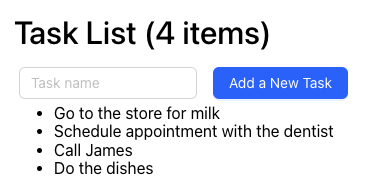

# Frontend Engineer Interview Exercises

For this set of exercises, we'll be working with a simple To-Do / Task list.
The task list already supports viewing the list and adding new to-do items.

To run the application, you'll need to:

```shell
> cd frontend
> npm i
> npm start
```

Initially it should look like this:




## Exercise 1: Layout and Styling

We are going to add some styling to the Task List:

### Task List

Make the following changes to the Task List:

* Background color should be: rgba(33,131,133,0.08);
* Give it rounded corners: 8px radius
* No matter how wide the window is, it should be no more than 800px wide.
* The list should have 10px padding on all sides

Task List Header

The card should have a header area that contains the title "Task List (n items)", and the Task Form. 
* The Task List title should be aligned to the left side
* The Form should be aligned to the right side
* The baseline of the Task List title should be aligned with the bottom of the form

### Task Cards

We want to change the task list for a simple unordered list to 

* On hover, the card should have a 1px solid black border
* The background of the card should be white
* The card should have rounded corners: 6px radius
* The card should have 5px padding on all sides
* The text should be aligned against the left side of the card

## Exercise 2: The users can delete a task from the list

Add a "Delete" button to each Task.

* The Delete button should be invisible unless the user hovers the mouse over the card.
* The Delete buttons should be positioned against the right edge of the task card.
* When the user clicks the delete button, call the delete task api and remove the card from the list.

Here are the docs for the Tasks API:
[API Documentation](./frontend/openapi.yaml)

A few questions:
* What's the url to delete a task? Which HTTP method does it use?
* If we were to add an endpoint to edit the name of a task, how would you design it?