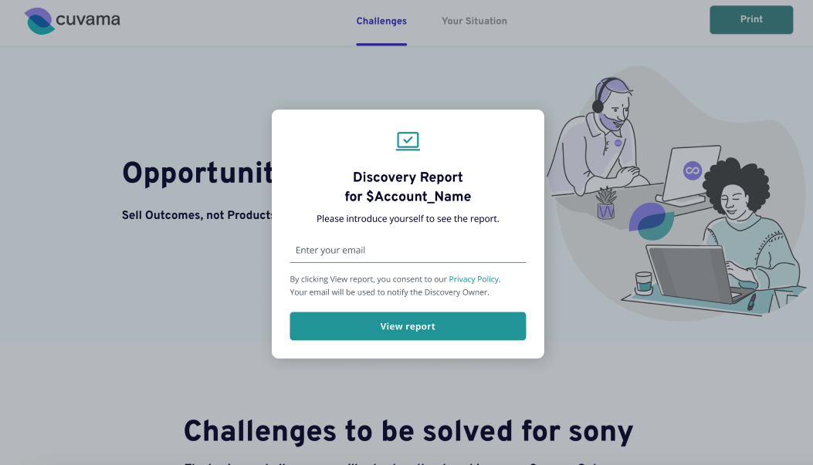
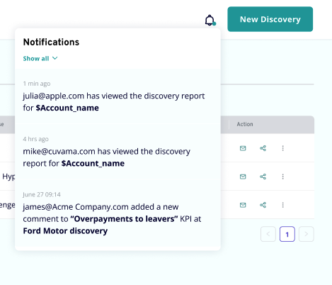
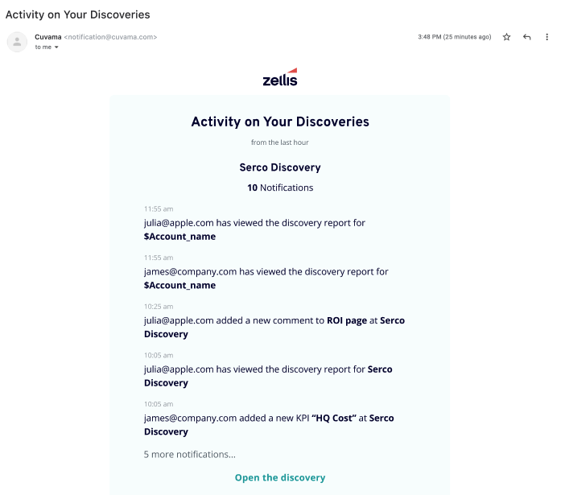

# QA Engineer Interview Exercises

## Exercise #1

Write a test plan for the user story below 

## Exercise #2

Write a Cypress test that executes part of the test plan

## Glossary

- **discovery**: This is a document created in Cuvama by a logged-in Cuvama user. This user that created the discovery 
is known as the **discovery owner** or **discovery creator**.
- **report** or **web report**: This web page is a read-only view of a discovery that can be shared with non-Cuvama users.

## User Story

As a discovery creator, I want to know which external users viewed a report that I shared and when. It will help me build better communication
with the prospect/customer.

## Requirements

The web report page is an existing page in Cuvama. We'd like to make some modifications to it.

- Create a functionality to block the Web Report page with a popup for unauthenticated users.
- Display the name of the discovery in the title of the Report page.
- Enable users to input an email address and click "View report" to access all report data. The form should validate the format of 
the email address. The "View Report" button should be disabled until a valid email is entered
- Configure the page settings to prevent scrolling when the pop-up is active
- Provide the Discovery Owner with notifications containing the email and timestamp for each session when the report is viewed.
- Send a notification about to the discovery creator, as part of the existing hourly email digest
- Use cookies to remember whether the user has submitted their email address

## Text Construction for Email and Notification Center
- Format the notification as follows: "(time) user@apple.com has viewed the discovery report for $Account_name"

## Changes for the Notification Center
- If a user has viewed a Report or left a comment, we no longer use the “Guest” author name for notifications on the platform and in
emails, instead, we use email addresses.

## Images

### Web Report with New Modal

### Notifications Center Example

### Email Digest Example

    

